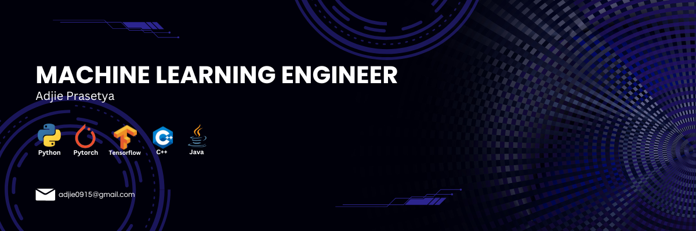

# 💫 About Me:
Hi, I'm Adjie Prasetya — a passionate Data Scientist with a strong enthusiasm for solving real-world problems through data. I’m currently deepening my expertise in:  Machine Learning – building predictive models, optimizing performance, and exploring advanced techniques.  Computer Vision – developing models for image recognition, object detection, and real-time video processing.  Natural Language Processing (NLP) – extracting insights from text, language modeling, and multilingual understanding.  Data Analysis – transforming raw data into actionable insights through statistical exploration and visualization.  Low-Level Programming – enhancing my systems-level thinking with C/C++, memory management, and performance tuning.  I enjoy working at the intersection of research and application, and I’m always eager to learn, contribute to open-source projects, and collaborate with other passionate minds in the tech community.  Feel free to check out my projects, connect with me, or reach out for collaborations!

## 🌐 Socials:
     

# 💻 Tech Stack:
          
# 📊 GitHub Stats:
 
 

---

<!-- Proudly created with GPRM ( https://gprm.itsvg.in ) -->

